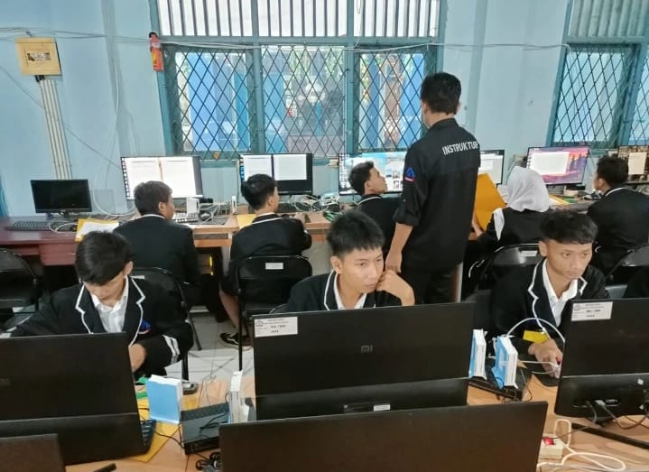
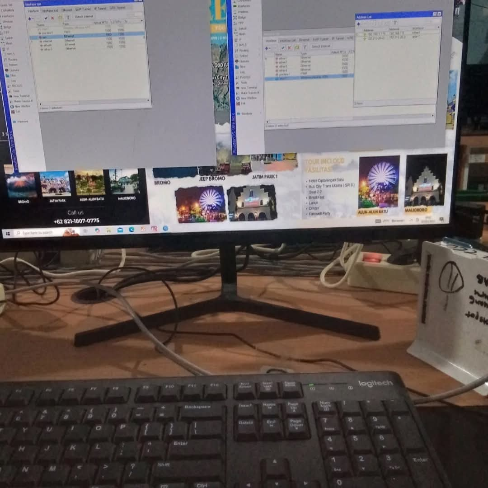
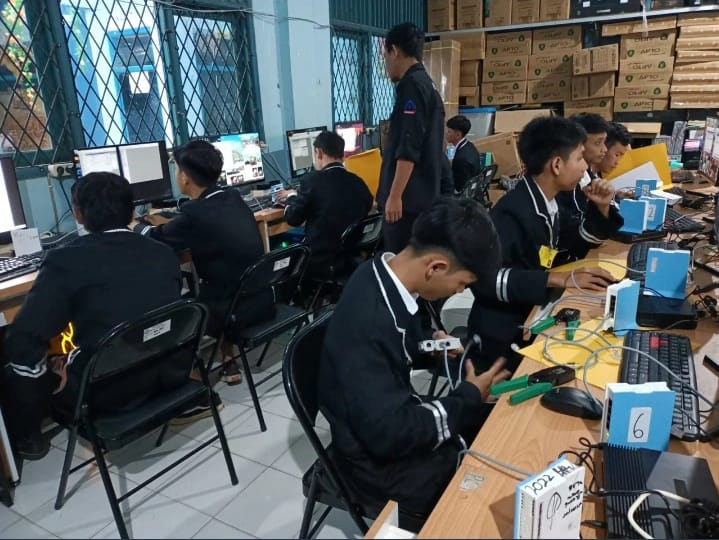
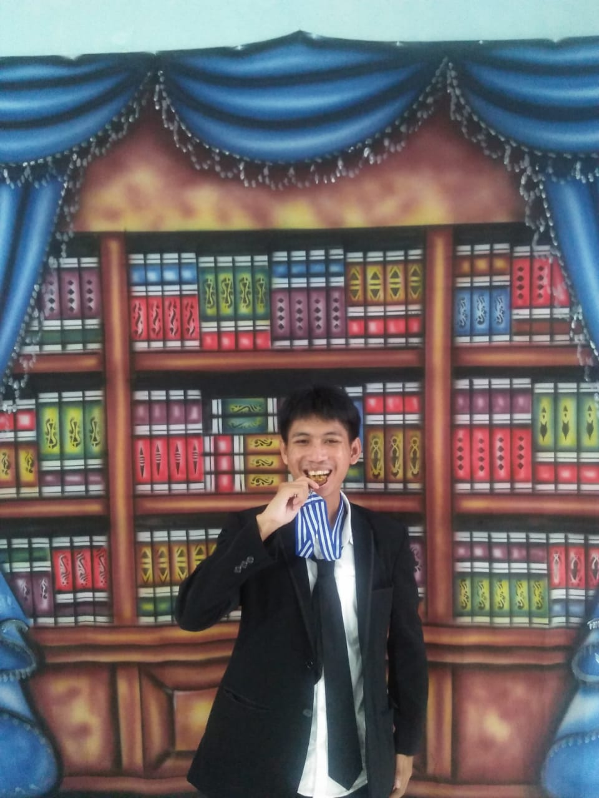

# about-me
inilah cerita saya
<!DOCTYPE html>
<html lang="id">
<head>
  <meta charset="UTF-8" />
  <meta name="viewport" content="width=device-width, initial-scale=1.0"/>
  <title>Profil Moch Akmal Almagribi</title>
  
</head>
<body>

  <header>
    <h1>Moch Akmal Almagribi</h1>
    
Mencintai Teknologi & Eksplorasi

  </header>

  <section class="about">
    <h2>Tentang Saya</h2>
    
Lulusan Teknik Komputer dan Jaringan (TKJ) dari SMK Bina Profesi Bogor dengan keahlian dalam konfigurasi jaringan, instalasi perangkat komputer, serta penguasaan software perkantoran dasar. Teliti, cepat belajar, dan memiliki pengalaman kerja lapangan di bidang teknis dan administrasi. Tertarik untuk berkembang sebagai Network Engineer.

  </section>

  <section class="slider">
    
    
    
    
  </section>

  <section class="skills">
    <h2>Keahlian Saya</h2>
    <ul style="list-style: none; padding: 0;">
      <li>✔️ Konfigurasi Jaringan</li>
      <li>✔️ Instalasi Perangkat Komputer</li>
      <li>✔️ Software Perkantoran (Word, Excel, dll)</li>
      <li>✔️ Administrasi Teknik</li>
    </ul>
  </section>

  <audio autoplay loop>
    <source src="musik.mp3" type="audio/mpeg">
    Your browser does not support the audio element.
  </audio>

</body>
</html>
